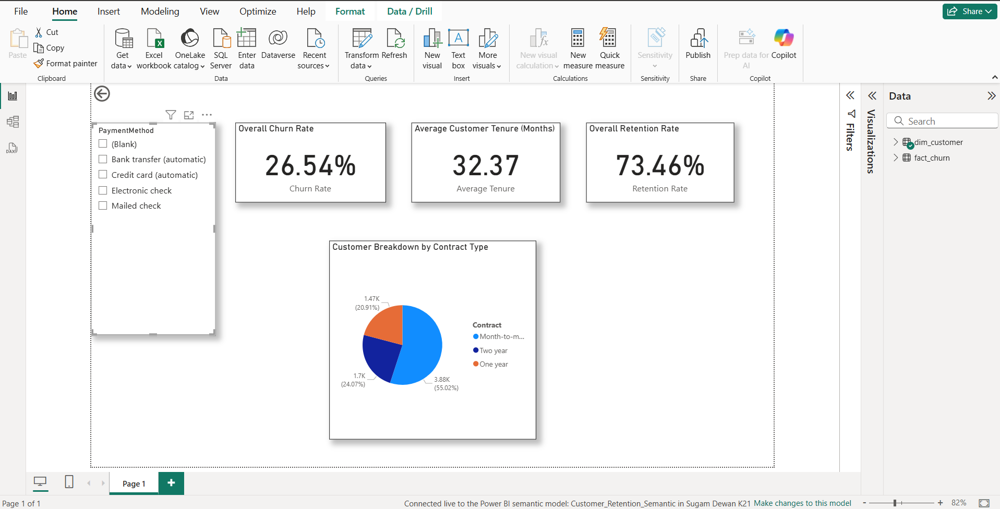

# PowerBI-CustomerRetention
An end-to-end customer churn analysis project using Microsoft Fabric for data engineering and Power BI for the interactive dashboard.
# Customer Retention & Churn Analytics Dashboard

## Introduction

This project provides an end-to-end analysis of customer churn for a fictional telecommunications company. The objective was to ingest raw customer data using Microsoft Fabric, build a robust star schema data model, and create an interactive Power BI dashboard to identify the key drivers of customer churn and provide actionable business insights.

## Technologies Used

* **Data Platform:** Microsoft Fabric (Lakehouse)
* **Data Ingestion & Transformation:** Dataflows Gen2
* **Data Modeling:** PySpark Notebooks, Star Schema Design
* **BI & Visualization:** Power BI
* **Key Language/Concepts:** DAX (for measures)

## Project Pipeline

1.  **Data Ingestion:** The "Telco Customer Churn" dataset (CSV) was ingested into the Fabric Lakehouse.
2.  **Data Cleaning:** A Dataflow Gen2 was used to clean the raw data, including correcting data types and handling blank values. The clean data was loaded into a Delta table.
3.  **Data Modeling:** A PySpark notebook transformed the clean data into a star schema with a fact_churn table and a dim_customer table, which is highly optimized for analytics.
4.  **DAX Measures:** Key business metrics were created using DAX, including Churn Rate, Retention Rate, and Average Tenure.
5.  **Dashboarding:** An interactive Power BI dashboard was built with cards, charts, and slicers to visualize the key insights.

## Final Dashboard

## Key Learnings

* Gained practical experience in data modeling by transforming a single, flat table into an optimized star schema with fact and dimension tables, which is crucial for building scalable and efficient BI reports.
* Authored complex DAX measures from scratch to define key business KPIs, including Churn Rate and Retention Rate, learning to use variables (VAR) for clarity and safe functions (DIVIDE) for robust calculations.
* Developed a comprehensive understanding of an end-to-end analytics workflow within Microsoft Fabric, from ingesting raw data with Dataflows to building an interactive dashboard connected to a Lakehouse.
* Learned to translate data into actionable business insights by using interactive visuals and slicers to discover that customers on "Month-to-month" contracts were the primary driver of churn.
* Enhanced real-world troubleshooting skills by navigating and resolving common development challenges, including data type errors, UI discrepancies, and synchronization issues between the semantic model and the report layer.

## Acknowledgements

* The dataset used is the "Telco Customer Churn" dataset, sourced from Kaggle.
